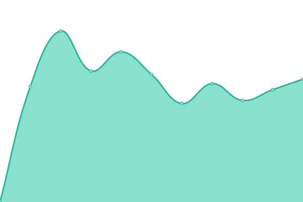
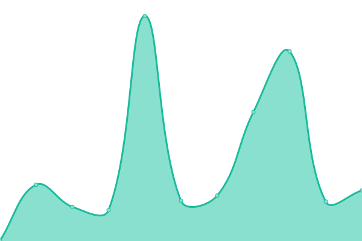
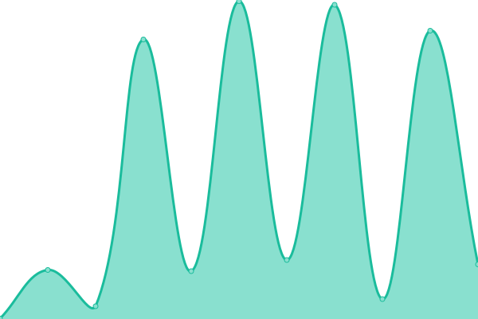
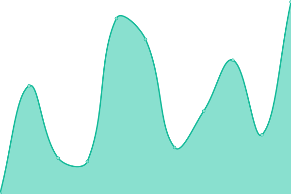

# [📈 Live Status](https://status.one.org): <!--live status--> **🟧 Partial outage**

This repository contains the open-source uptime monitor and status page for [Upptime](https://upptime.js.org), powered by [Upptime](https://github.com/upptime/upptime).

With [Upptime](https://upptime.js.org), you can get your own unlimited and free uptime monitor and status page, powered entirely by a GitHub repository. We use [Issues](https://github.com/upptime/upptime/issues) as incident reports, [Actions](https://github.com/upptime/upptime/actions) as uptime monitors, and [Pages](https://status.one.org) for the status page.

<!--start: status pages-->
<!-- This summary is generated by Upptime (https://github.com/upptime/upptime) -->
<!-- Do not edit this manually, your changes will be overwritten -->

| URL                                                                      | Status  | History                                                                                                                                  | Response Time                                                                                   | Uptime                                                                                                                                                                                                                                                |
| ------------------------------------------------------------------------ | ------- | ---------------------------------------------------------------------------------------------------------------------------------------- | ----------------------------------------------------------------------------------------------- | ----------------------------------------------------------------------------------------------------------------------------------------------------------------------------------------------------------------------------------------------------- |
| [Actionkit](https://act.one.org)                                         | 🟩 Up   | [actionkit.yml](https://github.com/ONEcampaign/project_upptime/commits/master/history/actionkit.yml)                                     |  353ms                  |                                    |
| [Africa Mobile Site](https://m.one.org/us)                               | 🟩 Up   | [africa-mobile-site.yml](https://github.com/ONEcampaign/project_upptime/commits/master/history/africa-mobile-site.yml)                   |  536ms         |                  |
| [Bridge Messaging Platform](https://api.messaging.dev.one.org)           | 🟥 Down | [bridge-messaging-platform.yml](https://github.com/ONEcampaign/project_upptime/commits/master/history/bridge-messaging-platform.yml)     |  457ms  |      |
| [Bynder](https://assets.one.org)                                         | 🟩 Up   | [bynder.yml](https://github.com/ONEcampaign/project_upptime/commits/master/history/bynder.yml)                                           |  516ms                     |                                          |
| [Dashboard](https://dashboard.one.org)                                   | 🟩 Up   | [dashboard.yml](https://github.com/ONEcampaign/project_upptime/commits/master/history/dashboard.yml)                                     |  345ms                  |                                    |
| [Intranet](https://intranet.one.org)                                     | 🟩 Up   | [intranet.yml](https://github.com/ONEcampaign/project_upptime/commits/master/history/intranet.yml)                                       |  1756ms                  |                                      |
| [ONE Against Poverty UK](https://www.oneagainstpoverty.org.uk)           | 🟩 Up   | [one-against-poverty-uk.yml](https://github.com/ONEcampaign/project_upptime/commits/master/history/one-against-poverty-uk.yml)           |  171ms     |          |
| [ONE Global Canada](https://www.oneglobalcanada.com)                     | 🟩 Up   | [one-global-canada.yml](https://github.com/ONEcampaign/project_upptime/commits/master/history/one-global-canada.yml)                     |  119ms          |                    |
| [ONE](https://www.one.org)                                               | 🟩 Up   | [one.yml](https://github.com/ONEcampaign/project_upptime/commits/master/history/one.yml)                                                 |  389ms                        |                                                |
| [ONE Africa](https://www.one.org/africa)                                 | 🟩 Up   | [one-africa.yml](https://github.com/ONEcampaign/project_upptime/commits/master/history/one-africa.yml)                                   |  300ms                 |                                  |
| [ONE International](https://www.one.org/international)                   | 🟩 Up   | [one-international.yml](https://github.com/ONEcampaign/project_upptime/commits/master/history/one-international.yml)                     |  215ms          |                    |
| [ONE Activists](https://activists.one.org/)                              | 🟩 Up   | [one-activists.yml](https://github.com/ONEcampaign/project_upptime/commits/master/history/one-activists.yml)                             |  816ms              |                            |
| [Accountability Music Awards](https://www.accountabilitymusicawards.org) | 🟩 Up   | [accountability-music-awards.yml](https://github.com/ONEcampaign/project_upptime/commits/master/history/accountability-music-awards.yml) |  73ms |  |
| [ONE US](https://www.one.org/us)                                         | 🟩 Up   | [one-us.yml](https://github.com/ONEcampaign/project_upptime/commits/master/history/one-us.yml)                                           |  181ms                     |                                          |
| [Rapidpro](https://one.wafl.chat)                                        | 🟩 Up   | [rapidpro.yml](https://github.com/ONEcampaign/project_upptime/commits/master/history/rapidpro.yml)                                       |  5035ms                  |                                      |
| [Scorecards](https://scorecards.one.org)                                 | 🟩 Up   | [scorecards.yml](https://github.com/ONEcampaign/project_upptime/commits/master/history/scorecards.yml)                                   |  199ms                 |                                  |
| [Staging](https://staging.one.org/international)                         | 🟩 Up   | [staging.yml](https://github.com/ONEcampaign/project_upptime/commits/master/history/staging.yml)                                         |  322ms                    |                                        |

<!--end: status pages-->

[**Visit our status website →**](https://status.one.org)

## 📄 License

- Powered by: [Upptime](https://github.com/upptime/upptime)
- Code: [MIT](./LICENSE) © [Upptime](https://upptime.js.org)
- Data in the `./history` directory: [Open Database License](https://opendatacommons.org/licenses/odbl/1-0/)
