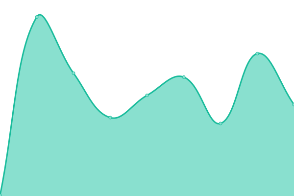

# [📈 Live Status](https://status.one.org): <!--live status--> **🟩 All systems operational**

This repository contains the open-source uptime monitor and status page for [Upptime](https://upptime.js.org), powered by [Upptime](https://github.com/upptime/upptime).

With [Upptime](https://upptime.js.org), you can get your own unlimited and free uptime monitor and status page, powered entirely by a GitHub repository. We use [Issues](https://github.com/upptime/upptime/issues) as incident reports, [Actions](https://github.com/ONEcampaign/project_upptime/actions) as uptime monitors, and [Pages](https://status.one.org) for the status page.

<!--start: status pages-->
<!-- This summary is generated by Upptime (https://github.com/upptime/upptime) -->
<!-- Do not edit this manually, your changes will be overwritten -->
<!-- prettier-ignore -->
| URL | Status | History | Response Time | Uptime |
| --- | ------ | ------- | ------------- | ------ |
|  [Actionkit](https://act.one.org) | 🟩 Up | [actionkit.yml](https://github.com/ONEcampaign/project_upptime/commits/HEAD/history/actionkit.yml) | 

 379ms
     
 | 

<a href="https://status.one.org/history/actionkit">94.14%</a>
    

|  [Africa Mobile Site](https://m.one.org/us) | 🟩 Up | [africa-mobile-site.yml](https://github.com/ONEcampaign/project_upptime/commits/HEAD/history/africa-mobile-site.yml) | 

 1224ms
     
 | 

<a href="https://status.one.org/history/africa-mobile-site">94.27%</a>
    

|  [Jobs Now Africa](https://www.jobsnowafrica.org/) | 🟩 Up | [jobs-now-africa.yml](https://github.com/ONEcampaign/project_upptime/commits/HEAD/history/jobs-now-africa.yml) | 

 174ms
     
 | 

<a href="https://status.one.org/history/jobs-now-africa">100.00%</a>
    

|  [ResourceSpace](https://photos.one.org) | 🟩 Up | [resource-space.yml](https://github.com/ONEcampaign/project_upptime/commits/HEAD/history/resource-space.yml) | 

 1048ms
     
 | 

<a href="https://status.one.org/history/resource-space">94.27%</a>
    

|  [Learning](https://learning.one.org) | 🟩 Up | [learning.yml](https://github.com/ONEcampaign/project_upptime/commits/HEAD/history/learning.yml) | 

 213ms
     
 | 

<a href="https://status.one.org/history/learning">94.27%</a>
    

|  [Intranet](https://intranet.one.org) | 🟩 Up | [intranet.yml](https://github.com/ONEcampaign/project_upptime/commits/HEAD/history/intranet.yml) | 

 255ms
     
 | 

<a href="https://status.one.org/history/intranet">94.27%</a>
    

|  [ONE Against Poverty UK](https://www.oneagainstpoverty.org.uk) | 🟩 Up | [one-against-poverty-uk.yml](https://github.com/ONEcampaign/project_upptime/commits/HEAD/history/one-against-poverty-uk.yml) | 

 135ms
     
 | 

<a href="https://status.one.org/history/one-against-poverty-uk">100.00%</a>
    

|  [ONE Global Canada](https://www.oneglobalcanada.com) | 🟩 Up | [one-global-canada.yml](https://github.com/ONEcampaign/project_upptime/commits/HEAD/history/one-global-canada.yml) | 

 224ms
     
 | 

<a href="https://status.one.org/history/one-global-canada">100.00%</a>
    

|  [ONE](https://www.one.org) | 🟩 Up | [one.yml](https://github.com/ONEcampaign/project_upptime/commits/HEAD/history/one.yml) | 

 328ms
     
 | 

<a href="https://status.one.org/history/one">94.27%</a>
    

|  [ONE Africa](https://www.one.org/africa) | 🟩 Up | [one-africa.yml](https://github.com/ONEcampaign/project_upptime/commits/HEAD/history/one-africa.yml) | 

 258ms
     
 | 

<a href="https://status.one.org/history/one-africa">94.27%</a>
    

|  [ONE International](https://www.one.org/international) | 🟩 Up | [one-international.yml](https://github.com/ONEcampaign/project_upptime/commits/HEAD/history/one-international.yml) | 

 224ms
     
 | 

<a href="https://status.one.org/history/one-international">94.27%</a>
    

|  [ONE Activists](https://activists.one.org/) | 🟩 Up | [one-activists.yml](https://github.com/ONEcampaign/project_upptime/commits/HEAD/history/one-activists.yml) | 

 364ms
     
 | 

<a href="https://status.one.org/history/one-activists">94.27%</a>
    

|  [Accountability Music Awards](https://www.accountabilitymusicawards.org) | 🟩 Up | [accountability-music-awards.yml](https://github.com/ONEcampaign/project_upptime/commits/HEAD/history/accountability-music-awards.yml) | 

 166ms
     
 | 

<a href="https://status.one.org/history/accountability-music-awards">100.00%</a>
    

|  [ONE US](https://www.one.org/us) | 🟩 Up | [one-us.yml](https://github.com/ONEcampaign/project_upptime/commits/HEAD/history/one-us.yml) | 

 146ms
     
 | 

<a href="https://status.one.org/history/one-us">94.27%</a>
    

|  [Rapidpro](https://one.wafl.chat) | 🟩 Up | [rapidpro.yml](https://github.com/ONEcampaign/project_upptime/commits/HEAD/history/rapidpro.yml) | 

 3907ms
     
 | 

<a href="https://status.one.org/history/rapidpro">100.00%</a>
    

|  [Data](https://data.one.org) | 🟩 Up | [data.yml](https://github.com/ONEcampaign/project_upptime/commits/HEAD/history/data.yml) | 

 316ms
     
 | 

<a href="https://status.one.org/history/data">94.27%</a>
    

|  [Staging](https://staging.one.org/international) | 🟩 Up | [staging.yml](https://github.com/ONEcampaign/project_upptime/commits/HEAD/history/staging.yml) | 

 157ms
     
 | 

<a href="https://status.one.org/history/staging">94.27%</a>
    

<!--end: status pages-->

[**Visit our status website →**](https://status.one.org)

## 📄 License

- Powered by: [Upptime](https://github.com/upptime/upptime)
- Code: [MIT](./LICENSE) © [Upptime](https://upptime.js.org)
- Data in the `./history` directory: [Open Database License](https://opendatacommons.org/licenses/odbl/1-0/)
